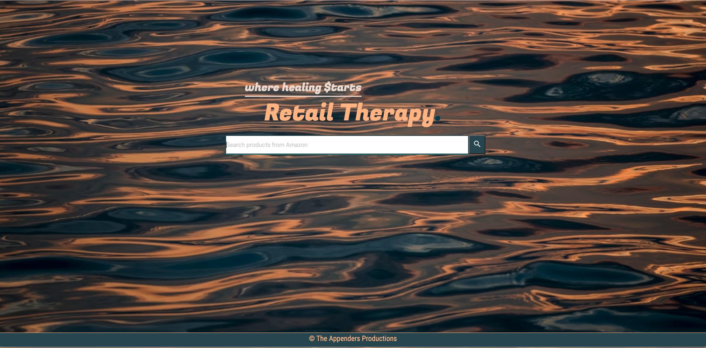
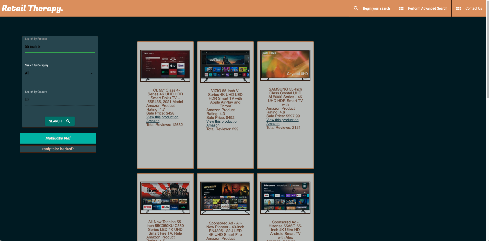

# Retail Therapy* is an app that that helps people who are feeling lost, down, or sad, and want to treat themselves to a relaxing 
shopping experience, that will help lift their mood. While shopping on our website you have access to *Amazon* products, and a
Motivational Quote Generator. 

### How to use?
When first visiting our website, you will first be presented with our landing page. To search for any product you may want, you can click 
the search bar with your curser and enter the products name, then click on the search button found on the right at the end of the search 
bar. You will then be re-directed to our search-results page that contains a grid of products from *Amazon*, that match your search.
On each product card, you will see the title of the product, the *Amazon Product Rating*, sale price, a link to the specific product on 
*Amazon*, and the amount of reviews the product has on *Amazon*. On the same search-results page, on the left hand side, you will be 
presented with a small form, so you can continue shopping, and looking for other products. Below that small form, you will see a blue 
"Motivate Me!" button, you can click that button for great, mood-modifying, motivational quotes. You can click this button as many times as you 
would like and a different quote will appear each time.

[Click here to see the deployed website.](https://vookmirvookmir.github.io/Project1-TheAppenders/)

Version:
**1.0**

####Credits
Materialize
Google Fonts

- Used HTML
- CSS 
- Javascript
- Use [Google](https://www.google.com) or another search engine to research this.
-https://code.jquery.com/jquery-3.6.0.min.js"
-https://fonts.googleapis.com/css2?family=Fugaz+One&family=Roboto+Condensed&display=swap
  
## API Reference
Amazon Products/review/keyword
Motivational Quotes

  
## Authors

- [@Mitchell ](https://github.com/VookmirVookmir/Project1-TheAppenders)
- [@Fox ](https://github.com/VookmirVookmir/Project1-TheAppenders)
- [@Jayla](https://github.com/jayladenae)
- [@Alex](https://github.com/VookmirVookmir/Project1-TheAppenders)
- [@Carlos](https://github.com/VookmirVookmir/Project1-TheAppenders)
## Support

For support, email Theappenders@gmail.com or join our Slack channel.

Deployment date:
**10/08/2021**

Copyright (c) 2021 JAYLA NEWTON, ALEX GONZALES, MITCHELL ROBBINS, FOX RIGNEY, CARLOS HERNANDEZ (THE APPENDERS)

Permission is hereby granted, free of charge, to any person obtaining a copy of this software and associated documentation files
 (the "Software"), to deal in the Software without restriction, including without limitation the rights to use, copy, modify, merge,
 publish, distribute, sublicense, and/or sell copies of the Software, and to permit persons to whom the Software is furnished to do so,
 subject to the following conditions:

The above copyright notice and this permission notice shall be included in all copies or substantial portions of the Software.

THE SOFTWARE IS PROVIDED "AS IS", WITHOUT WARRANTY OF ANY KIND, EXPRESS OR IMPLIED, INCLUDING BUT NOT LIMITED TO THE WARRANTIES OF 
MERCHANTABILITY, FITNESS FOR A PARTICULAR PURPOSE AND NONINFRINGEMENT. IN NO EVENT SHALL THE AUTHORS OR COPYRIGHT HOLDERS BE LIABLE 
FOR ANY CLAIM, DAMAGES OR OTHER LIABILITY, WHETHER IN AN ACTION OF CONTRACT, TORT OR OTHERWISE, ARISING FROM, OUT OF OR IN CONNECTION 
WITH THE SOFTWARE OR THE USE OR OTHER DEALINGS IN THE SOFTWARE.
  
